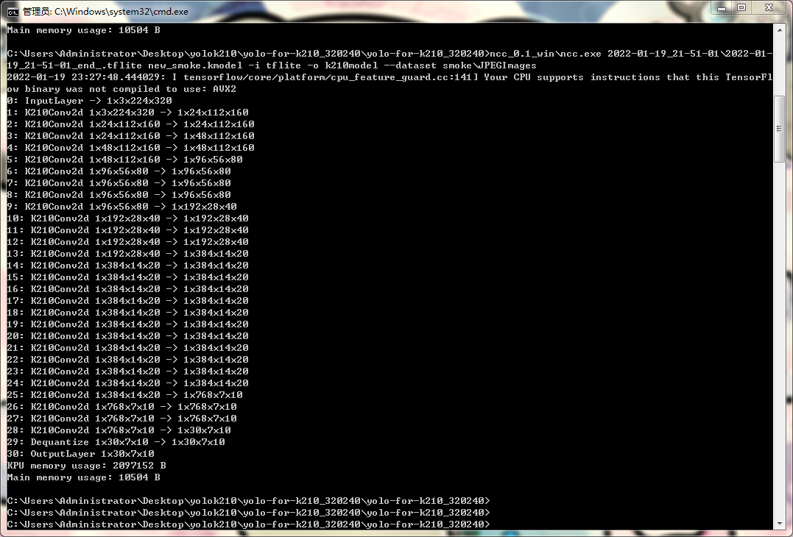
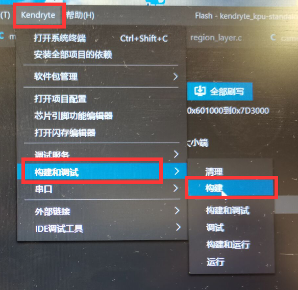
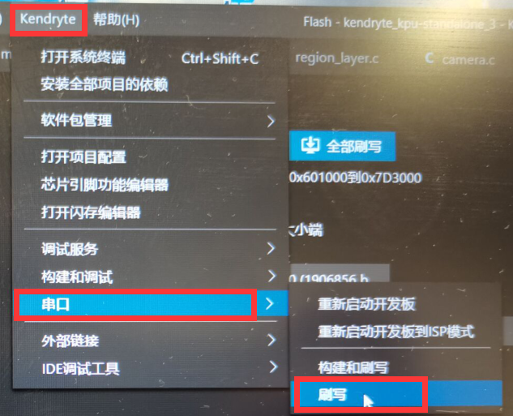
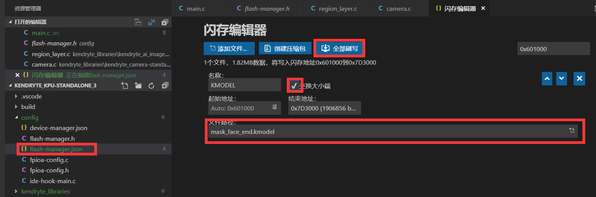
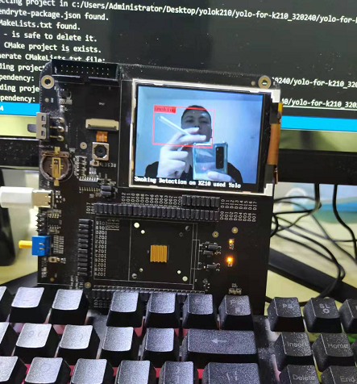

# YOLO-k210-smoking
## 吸烟检测在k210上运行，转换后的kmodel模型才1.81M大小，原h5模型为21.4M大小，量化结果明显，kmodel模型在K210上实时运行流畅不卡顿，开发板采用官方的kd233

### 模型转换工具下载

   下载ncc工具箱：网盘下载：https://pan.baidu.com/s/1NT2tG4Rv2YJyjOKRh-3t4w  提取码：z9fr

将[ncc_0.1_win.zip]放置在工程根目录，解压到当前文件夹
        

### 1.如果只有自己的样本图片(任意尺寸都可以)，还没有VOC格式的xml注释文件，可使用根目录下的[labelImg.exe]进行注释：

### 2.开始训练：（如果谁有320*240输入的小检测模型，欢迎来分享）

##### 2.1运行get_annchors.py kmeans聚类找到现有数据的annchors

##### 2.2python train.py 

   等待训练结束，会出现时间命名的文件夹，里面的tflite文件就是训练好的模型,重命名(如：test.tflite)并复制到工程根目录

### 3. 转换成Kmodel：
ncc_0.1_win\ncc test.tflite test.kmodel -i tflite -o k210model --dataset train_img

   转换完成根目录会出现test.kmodel，即可烧录进k210中运行

 

### 4.使用Kendryte IDE，编译模型

没有Kendryte IDE的可以百度自行下载

### 5.烧录编译好的二进制文件到开发板KD233

### 6.烧录模型kmodel到闪存文件

### 7.最终运行效果

###### 为了看效果，我还弄了一只烟

